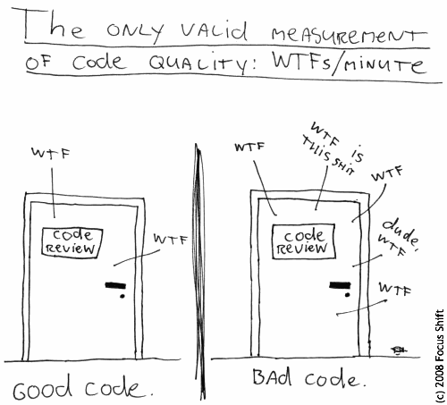

A Succinct Coding Policy
========================

Code should be *beautiful* before being efficient. Such code is often recognisable by being, among&nbsp;other&nbsp;things:

  - *Maintainable*
  - *Testable*
  - *Extendable*
  - (Reasonably) *Easy To Understand*
  - *Reusable*

Most importantly, a healthy codebase can, to some, be a source of *happiness*.

Kiss, Dry, Comment, Test, Repeat
------------------------------

Code has a life of its own and, due to practical constraints or other influences – ranging from entropy to developper laziness – can not always be maintained in a perfect state. Still, while including real-world necessities, code designers and maintainers should strive to follow the principles below.

### Keep It Simple, Stupid

  - Divide and conquer: more, smaller functions/objects beat less, longer functions/objects
  - A function or object should have 
    - a single, well-defined role
    - a concise comment explaining that role if it is not obvious

### Don't Repeat Yourself

  - Function duplication lead to multiple code-paths doing the same&nbsp;thing.
  - Two functions doing exactly the same thing have exactly the same bugs.
  - A duplicate bug needs a duplicate fix.
  - It is easy to forget an instance of the bug.
  - Unfixed bugs lead to unhappy people.
  - Unhappy people lead to drama.
  - Drama leads to the dark side.

Thus, avoid copy-pasting or any other general duplication of functionality. In addition to saving karma points, this has other benefits you will soon become aware of. 

### Comment
There is something worse than no documentation: wrong or misleading documentation. Hence, just writing a document and saving it to a random place generally leads to added frustration down the line.

While a minimal amount of external doc' can sometimes not be avoided, it is essential to keep explanations about what a piece of code does as close as possible to said piece of code, in order to make it easy both to find and update it in parallel to the code.

Thus, the first practical one of the following options should always be considered:

  - Comments in the code or configuration file.
  - General explanations in a README stored wherever makes most sense.
  - Wiki pages or resources outside of the code repo. Should be used as a last resort.

During the review phase, reviewers will be the best persons to indicate where more comments are needed.

### Test
The second best moment to design tests for your code is right after writing it. The best moment is *before* writing your code, but this requires to more or less know what you are going to write, which is not always practical and, some might argue, takes away part of the fun of developing software.

The discussions around merits of precise specifications being a religious war on their own, we will simply note that as long as:

  - reviewers can't discern between tests written after or before the code
  - your tests covers a generous portion of the code

... you are not burning karma points and might even earn some when your tests catch regressions in the future.

Slightly Opinionated 
-----------------------

  - Prefer immutable objects/fields over variables, whenever practical
  - Prefer interfaces and composition over inheritance
  - Prefer final public fields instead of getters for simple structures
  - When in doubt, switch to pen & paper. 
  - If doubt persists, discuss.

   
Anti-Patterns 
------------------------------
 
As many things in life, defining good code is non-trivial. However, you generally recognise bad code when you see it: a good start in improving code quality is knowing what should absolutely be avoided.

> *Premature optimisation is the root of all evil .* –– Donald Knuth 

The following list is non-exhaustive and for entertainment only:

  - God Object: https://en.wikipedia.org/wiki/God_object
  - Reinventing the wheel: https://en.wikipedia.org/wiki/Reinventing_the_wheel
  - Not Invented Here (NIH): https://en.wikipedia.org/wiki/Not_invented_here
  - Spaghetti Code: https://en.wikipedia.org/wiki/Spaghetti_code
  - Shotgun Surgery: https://en.wikipedia.org/wiki/Shotgun_surgery
  
    
  
  

